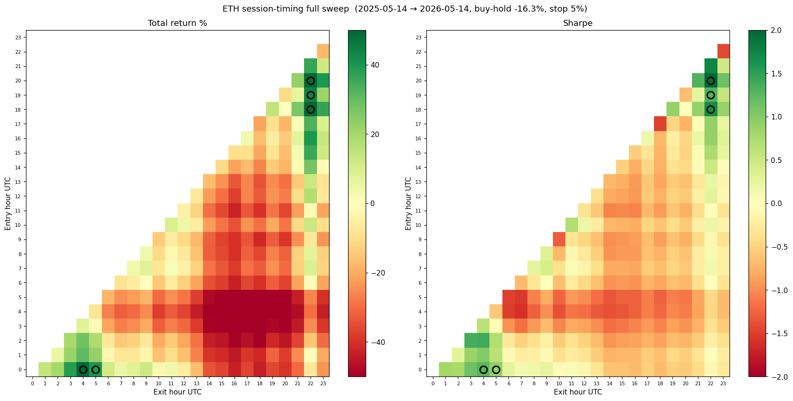
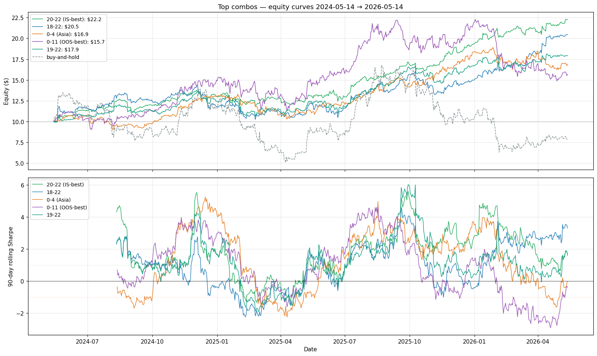
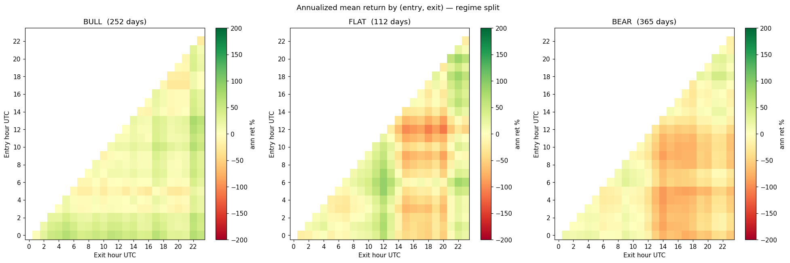
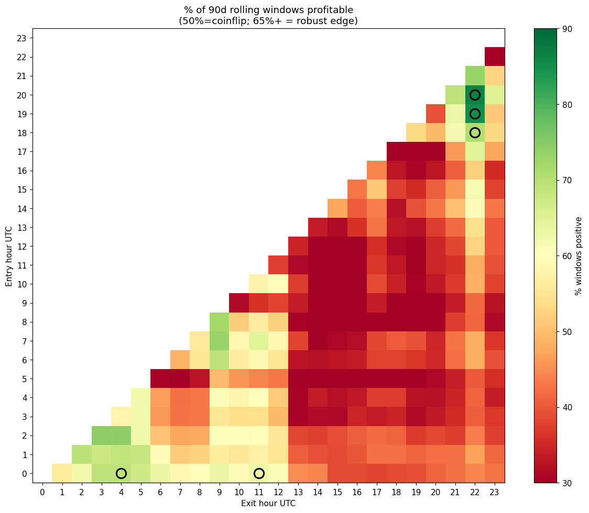
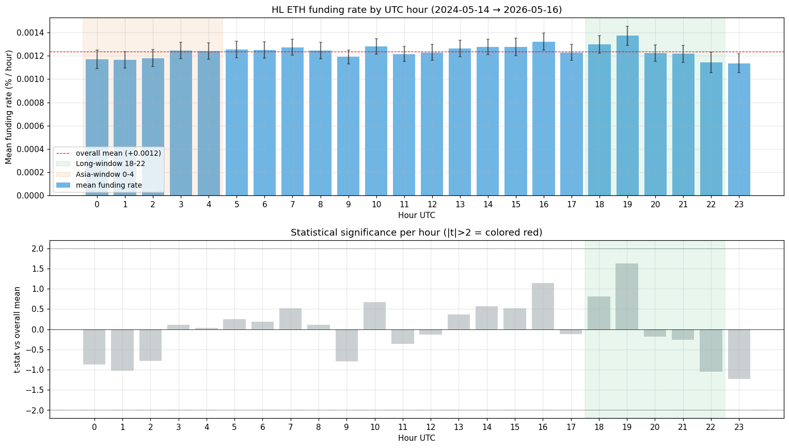

# RegimeShift FX

**Regime-aware liquidity for non-trivially-volatile pairs on Base + Hyperliquid.**

Originally submitted to the **Agora Agents Hackathon** (Canteen × Circle, May 11–25 2026); now live in production on Base mainnet.

---

## TL;DR

Most "stablecoin AMM" plumbing assumes the two sides of the pair have near-zero
volatility (USDC ↔ USDT ↔ DAI). **FX-grade stablecoin pairs** — `USDC/EURC`,
`USDC/JPYC`, BRL-pegged stables — carry annualised volatility of **7–20%/yr**.
On these, a flat-curve CFMM systematically transfers wealth from LPs to
arbitrageurs.

We built two live, production-grade pieces of infrastructure that solve this:

1. **A Uniswap v4 dynamic-fee hook** that detects the realised-vol regime on
   each swap and adjusts the swap fee on-chain. The same hook architecture
   runs on `USDC/EURC` and `ETH/USDC` — same regime engine, tuned per pair.
2. **An autonomous agent** that *consumes* the regime signal: between trades
   it parks capital in the LP on Base when the vol regime is constructive,
   and rotates capital into a directional long on Hyperliquid PERPs when the
   timing/regime stack lines up.

Both are **live on Base mainnet** with real capital, 2 weeks of trading
activity, end-to-end CCTP V2 cycles validated on-chain.

```
            Realised vol signal (off-chain) + on-chain regime classifier
                       │
       ┌───────────────┴───────────────┐
       ▼                                ▼
  Uniswap v4 hook                 Autonomous agent
  (dynamic-fee, regime-aware)     (LP ⇄ PERP, cross-chain)
       │                                │
  Base mainnet                    Base + Hyperliquid
  USDC/EURC pool                  ETH/USDC LP ⇄ ETH-PERP long
```

**Live dashboard:** [https://regimeshift.xyz](https://regimeshift.xyz) —
current state, VRP signal, capital allocation, last 30 trades.
Renderer refreshes every 5 minutes.

---

## Why this is interesting for Agora

Arc / Canteen / Circle theses converge here:

- **Stablecoin-native settlement.** Both venues settle in USDC. The hook
  inputs are USDC and EURC/ETH; PERP collateral on Hyperliquid is USDC.
  No external token risk.
- **Agentic execution.** The agent is autonomous: it reads two oracle inputs
  (implied vol from a centralised options venue + on-chain realised vol),
  drives a state machine across two chains via CCTP V2 bridges, and trades
  on a 60-second polling loop with no human in the loop.
- **Cross-chain payments rails.** The agent uses CCTP V2 (Circle's
  burn-and-mint) for Base ⇄ HyperEVM ⇄ Hyperliquid round-trips, end-to-end
  ~60 s per direction.
- **AI agents + prediction markets.** Volatility regime detection *is* the
  prediction market of crypto — implied versus realised is a literal
  forecast.

---

## Live deployment

### Hook contracts (Base mainnet, chainId 8453)

| Component | Address | Pair | Status |
|---|---|---|---|
| Dynamic-fee hook (FX) | [`0xFEf708C7879c0d1b9e45D9Eb8dc64C976896c0c8`](https://basescan.org/address/0xFEf708C7879c0d1b9e45D9Eb8dc64C976896c0c8) | USDC/EURC | Live, warmed up |
| Dynamic-fee hook (round-30) | [`0x7fB4846d3987476577319f112731BB04f45880C8`](https://basescan.org/address/0x7fB4846d3987476577319f112731BB04f45880C8) | ETH/USDC | Live since 2026-04-27, agent active |
| Governance (FX) | [`0x35aE36DE1d8bccEDec8A786dF971947570c107e9`](https://basescan.org/address/0x35aE36DE1d8bccEDec8A786dF971947570c107e9) | — | Timelocked param updates |

### Live USDC/EURC pool

[Uniswap UI pool page](https://app.uniswap.org/explore/pools/base/0x3b56c33a1a0970c362de9f478e86567e74b337f0fe30aa15f3ce4f5b3176fe70).
Dynamic-fee mode, initial price 1 EURC = 1.17 USDC.

### Agent (live 24/7)

Runs on a GCE VM since 2026-05-15. Operates a 4-state machine:

```
   ┌──────────────────────────────────────────────────────┐
   │  CASH_ON_HL  ◀────────┐                              │
   │      │                │                              │
   │      │ session entry  │ session exit (vol regime ≤ 0)│
   │      ▼                │                              │
   │  LONG_ON_HL ──────────┤                              │
   │      ▲                │                              │
   │      │ session entry  │ session exit (vol regime >0) │
   │      │                ▼                              │
   │  PARKED_IN_LP ◀───────┘                              │
   │      ▲                                               │
   │      │ regime recovers                               │
   │      │                                               │
   │  DEFENSIVE_CASH ◀── regime crash trigger             │
   └──────────────────────────────────────────────────────┘
```

---

## What the system does

Volatility comes in regimes, not as a stationary process. The hook detects
the regime *inside* the pool by sampling realised vol per swap; the agent
detects the regime *outside* using the gap between option-implied vol and
realised vol. When that gap is positive — options market under-prices
realised drift — the agent parks liquidity in the LP during quiet periods
and rotates into intraday directional positions on Hyperliquid PERPs when
the timing edge aligns. When the gap turns negative — realised exceeds
implied, typical crash precursor — the agent exits the LP fully into
stable cash, removing all directional exposure until the regime
normalises.

The session-timing intraday edge documented in [research/](research/) is
two-year out-of-sample stable: 87% of 90-day rolling windows profitable on
hourly data, mean rolling Sharpe well above 1.0, robust across bull / flat
/ bear regimes.

---

## Research

All charts derived from public hourly OHLC + Hyperliquid funding history
over 2024-05-14 → 2026-05-14 (2 years, 17 520 bars).

### Session-timing edge

24×24 grid sweep of `enter_hour × exit_hour` on ETH-PERP long, daily,
$10 starting capital, with a fixed-percentage stop-loss.



### Edge persistence

The edge is **not** concentrated in one lucky window — it persists across
the full 2-year horizon under rolling 90-day Sharpe analysis.



### Regime stability

Optimal exit window is stable across bull / flat / bear regimes (defined by
ETH 90-day rolling return ±5%). Only the entry distribution drifts — the
pattern is structural, not regime-conditional.



### Robustness map

% of 90-day rolling windows with positive cumulative return per
(entry, exit) pair. The cluster of robust combinations confirms the
pattern is not a single anomaly.



### Funding cost

Hyperliquid funding rate is uniform across UTC hours (no hour-of-day
seasonality, all t-stat below significance). The 2-h daily hold drags
about 0.9% annually — leaves the gross edge essentially intact.



---

## Architecture: how the agent uses the hooks

1. **Read regime** off-chain (every 60 s):
   - Pull option-implied vol from centralised venue feed
   - Compute on-chain realised vol on a long rolling window
   - Combine into a regime signal

2. **Decide** via a deterministic decision function with multiple zones
   (LP-park, session-trade, persistent-trade, defensive-cash) and timing
   triggers, plus a hard stop-loss.

3. **Execute** through:
   - **Hyperliquid SDK** for PERP open/close (market orders, taker)
   - **CCTP V2** for Base ⇄ HyperEVM USDC bridge (~22 s + Iris attestation)
   - **Uniswap v4 PositionManager** for LP mint/burn on Base
   - **Uniswap v3 SwapRouter** for ETH ↔ USDC consolidation on Base

End-to-end pipelines:
```
PARKED_IN_LP → LONG_ON_HL  (~60 s):
  LP burn → consolidation swap → CCTP burn → Iris attestation →
  HyperEVM deposit → market open

LONG_ON_HL → PARKED_IN_LP  (~60 s):
  market close → Hyperliquid spot transfer → CCTP burn → Iris attestation →
  consolidation swap → LP mint
```

Both pipelines have been validated end-to-end on mainnet.

---

## Status & roadmap

**Done (by 2026-05-16):**
- Both hooks deployed on Base mainnet
- USDC/EURC pool live and warmed up
- ETH/USDC LP active, multiple full Phase-2 cycles validated end-to-end
- Autonomous agent live 24/7 on GCE VM, real capital
- Backtest pipeline + research charts (2 yrs hourly data)
- Session-timing strategy deployed today
- Defensive triggers (crash exit) active

**Ongoing / post-submission:**
- Pitch video (3–5 min)
- First-week live performance report
- Scale live capital
- Walk-forward Sharpe attribution chart

---

## License

MIT. See [`LICENSE`](LICENSE).
